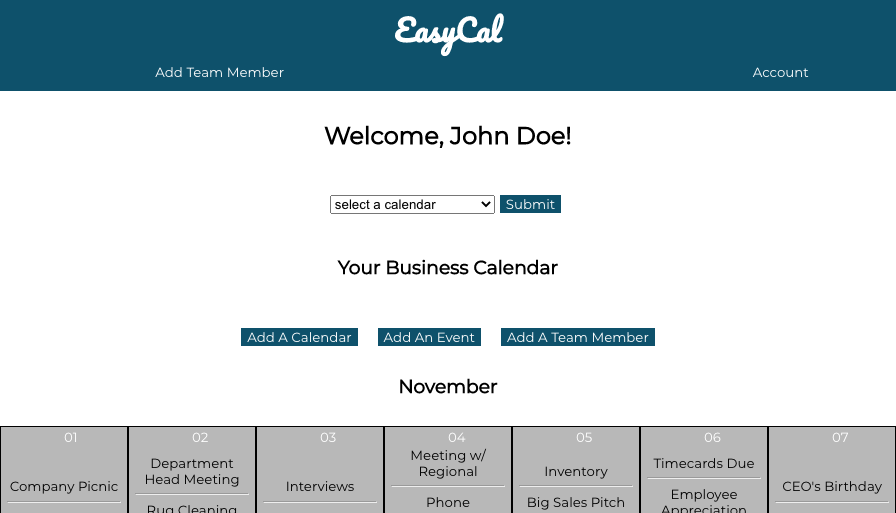

EasyCal

Front End Technology Used: React.js, JavaScript, Html, CSS

Live App: https://easycal-react.jesterfs.vercel.app/

Back End Repo: https://github.com/jesterfs/easycal-api

Summary: EasyCal is an office scheduling software that lets users create multiple calendars for their team members based on any number of specifications, from department to small projects to the corporate level.

The user can navigate to their preferred transit line and select a station from the map. (seen below)

